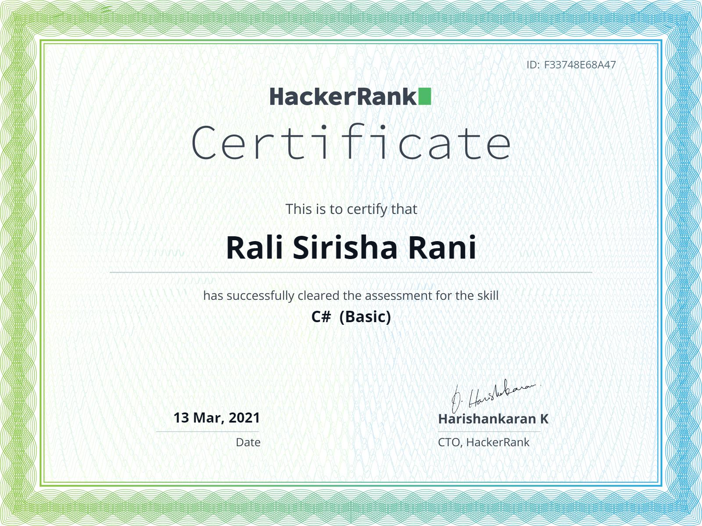

# Profile
**Rali Sirisha Rani**

**Contact No** : +91 7989511873, **E-Mail** : [ralisirisha.rani@ltts.com](mailto:ralisirisha.rani@ltts.com)

\_\_\_\_\_\_\_\_\_\_\_\_\_\_\_\_\_\_\_\_\_\_\_\_\_\_\_\_\_\_\_\_\_\_\_\_\_\_\_\_\_\_\_\_\_\_\_\_\_\_\_\_\_\_\_\_\_\_\_\_\_\_\_\_\_\_\_\_\_\_\_\_\_\_\_

**Programming Skills:** C#

**Frameworks:**

- .NET Framework
- ADO.NET
- Entity Framework
- ASP.NET MVC
- ASP.NET Web API

**Tools:**

- SQL Server Management System (SSMS)
- SQL
- Visual Studio 2019
- PostMan
- LINQ Pad

**Platforms:**

- Azure DevOps
- GitHub

**Badges:**

HackerRank Badges

Microsoft Badges

 

Certificates

**Mini Projects:**

1. DemoKart Application: [https://dev.azure.com/ralisirisharani/\_git/99003668\_DemoKart\_ASP.Net](https://dev.azure.com/ralisirisharani/_git/99003668_DemoKart_ASP.Net)
2. Embedded Lab Management:

[https://dev.azure.com/ralisirisharani/99003668\_Emb\_Lab\_Management](https://dev.azure.com/ralisirisharani/99003668_Emb_Lab_Management)
